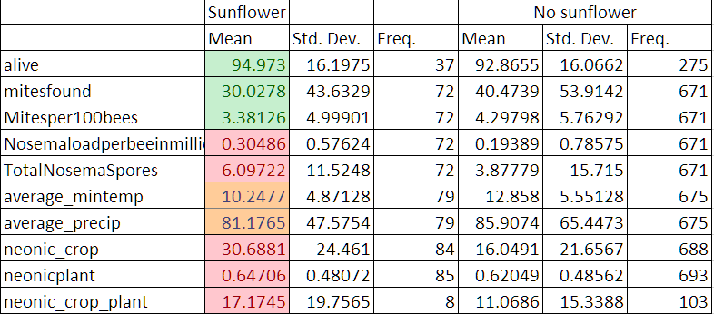

```{r setup, include=FALSE}
knitr::opts_chunk$set(echo = TRUE)

```


### Data 

1. Outcome variables :  number of alive bees, Varroa mites and Nosema parasite loads as indicators of honey bee health.

Data source: USDA Animal and Plant Health Inspection Services (APHIS) Survey of Honey Bee Pests and Disease, containing the geographic coordinates of the apiaries. 

429 apiaries in 33 states throughout the United States) and year the sample was taken (2009 to 2014). 
2. sunflower acreage in a two-mile radius of apiaries from NASS Cropscape data

3. control variables : forage availability (NDVI?) and weather, from NASS’ Vegscape layers and Oregon State University’s Prism database.

```{r,include=FALSE}
# USDA NASS provides data about on the vegetation cover of the United States over the period from 2000-
# 2014.  For this study, we use data on the Normalized Difference Vegetation Index (NDVI), which
# measures the density of vegetation within pixels representing 15 acres of landscape (Mueller and
# Minchenkov 2013). Data on the NDVI is provided on a daily, weekly and biweekly basis. We use apiaries’ locations as well as sample collection time, and obtain the biweekly NDVI data, which provides information about the average NDVI within a 16 day window.
```

```{r,include=FALSE}
#The USDA APHIS conducts the Honey Bee Pest and Disease Survey as a means of identifying pests,

#pathogens, and disease affecting honey bees in the United States. 

# This data set contains information
# on apiary samples collected from 2009 to 2014 throughout the United States. Forty states with 2552 
# samples are in the data set. 

# In each sampled apiary, at least 8 colonies are tested for a number of diseases and pests. 
# Not all samples are tested for pollen residue; only 676 samples have pollen sample results.

# Since there is no crop information for samples in Hawaii, we exclude these areas from our analysis as well.

```
  


### Methods 

To estimate the degree of exposure to sunflower, we map the sampled non-migratory apiaries in APHIS onto NASS cropscape data to determine the crops grown within a two-mile radius of each apiary. To control for the timing of exposure to nearby sunflowers, we collect information on the time of planting (mid-April to late May) and blooming for sunflowers (during summer and a portion of fall).

The resolution of these data is set at 30 meters squared per pixel (USDA NASS n.d.). We extract the crop area within two-miles of each apiary as this is vicinity in which bees typically do most of their foraging (Eckert, 1933). Therefore, this two-mile area, which comprises over 8,000 acres, provides the best estimate of the crops and landscape that bees would interact with during their foraging. We then calculate the percentage of the two-mile buffer area occupied by sunflower with the assumption that a linear relationship exists between changes in treated crop area and morbidity loads.

```{r,include=FALSE}
# To control for unobserved regional effects, we use USDA census regions. These regions are selected to
# increase comparability with studies on overwintering losses and to isolate regional cropping patterns.
```


We start by exploring the correlation between sunflower and honey bee pests. We compare colonies located near sunflowers to those further away, during planting, blooming versus other times of year. We also plan to take into account the biology, honey bee educators, honey bee patterns.

```{r,include=FALSE}
# For our analysis, we first use a logit regression to ask what factors are associated with finding
# neonicotinoid contamination in the hive. Second, we use a multivariate regression to estimate the effect of neonicotinoid contamination on colony Nosema and Varroa loads. We use several specifications, first
# with no fixed effects, then adding fixed effects for region and year. Then we include other controls for
# forage availability and weather. In the first stage, we compare those apiaries that are near neonicotinoid-
# treated crops whose samples are taken during planting to other apiaries near neonocotinoid-treated crops
# whose samples are taken other times of year, and to apiaries who are not near treated crops. For the
# second analysis on health outcomes, using the fixed effects, we compare disease outcomes of those
# apiaries where neonicotinoids are found to apiaries tested in the same region, in the same year and during
# the same time of year.
```


### Maps 

1. Sunflower growing area map 

```{r,include=FALSE}
 library(haven)
bee <- read_dta("Data/bee data new 14-15 v.5.25.dta")
 

# some standard map packages.
#install.packages(c("maps", "mapdata"))

# the github version of ggmap, which recently pulled in a small fix I had
# for a bug 

# devtools::install_github("dkahle/ggmap")

require(tidyverse)
bee.df = as.data.frame(bee) %>% 
  filter(!is.na(sunflower) & !is.na(nosemaloadperbeeinmillions) & !is.na(mitesfound))   
  

bee.df = bee.df %>% mutate(sunper = sunflower/totalarea)

bee.df = bee.df %>% mutate(sun_acres = sunflower/4046.86)


summary(bee.df$sunper)

summary(bee.df$cornper)

summary(bee.df$totalarea)
write.csv(bee.df,"Data/bee_data.csv")

library(ggplot2)
library(ggmap)
library(maps)
library(mapdata)
  
sunflower.map = bee.df %>% dplyr::select(x,y,sunflower, state)
sunflower.map$x = as.numeric(sunflower.map$x)
sunflower.map$y = as.numeric(sunflower.map$y)
sunflower.map$sunflower = as.numeric(sunflower.map$sunflower)

state.names= read.csv("Data/states_names.csv")

state.names = state.names %>% 
  mutate(region = tolower(State)) %>% 
  mutate(state = Abbreviation) %>% 
  select(state,region)


sunflower.map = sunflower.map %>% left_join(state.names,by="state")
   

```


Growing states: centered around South Dakota and North Dakota. 

states with acres less than 100 acres: Pennsylvania, New Jersey, California, 
Washington, Wisconsin, Arkansas, Virginia,
Texas, Michigan 


2. Maps for Varroa mites and Nosema parasites for non-migratory apiaries with pollen results. 


```{r,include=FALSE}
 
# The first stage examines whether an apiary with a large share of sunflower within the foraging radius have a higher probability to have less insests problem during certain times of the year. In other words, we ask at which time of the year do we observe insects problem in the
# apiary, and does this timing align with planting or blooming of sunflower.

# Crop acre*Bloom time
# Crop acreage
# Planting time
# Crop acre*Planting time
# Bloom time
# 
# Minimum Temperature
# NDVI
# Precipitatio

# Nosema Parasite /  Varroa Mites
# Neonics
# NDVI
# Minimum Temperature
# Precipitation

# seasonality, sun flower blooming, control for the timing, in 2km radius, control for the timing and control for location

```


 
 

#### Summary Statistics 

Out of a total of 743 observations over the two years (2014-2015),  72 observations in our data have sunflower within the 8000 acres area. 60 of them greater than 900 square meters .

More than half of the observations with large sunflower acreage (33 out of 60) are during July to October when there is possible sunflower blossom. 5 of them are between April to May when it is the planting season of sunflowers.  Others are during November and February. 


```{r,include=FALSE}
nrow(bee.df %>% filter(sunflower>1000)  ) 

nrow(bee.df %>% filter(sun_acres>1)  ) 

#nrow(bee.df %>% filter(sunflower>900 & month>6 & month <10 )   ) 

nrow(bee.df %>% filter(sunflower>900 & month>3 & month <6 )   ) 

temp.df =  bee.df %>% filter(sunflower>1000)
unique(temp.df$month)

# nrow(bee.df)
# We compile information on the planting percentage by month for the United States each year. Most spring planting occurs between April and June. Fall planting occurs between September and November. Due to a lack of information, we estimate the planting window for canola to be from April 20 to June 10 every year. Information on bloom timing of honeybee forage plants is provided on HoneyBeeNet, which not only lists the plants that bees frequently forage within each region within each state, but also whether each plant is significant nectar source or not (Nickeson, 2010).


# extract the acreage information from the NASS Cropscape data?

```

group 0 is no sunflower, group 1 is at least 900 square meters sunflower acreage within the 2 miles radius.





### Correlation 


```{r, echo=FALSE}
library(corrplot)

cor.df = bee.df %>% dplyr::select(mitesfound,mitesper100bees,sunflower,nosemaloadperbeeinmillions,totalnosemaspores,average_mintemp,average_precip)
corrplot(cor(cor.df), method = "circle")

```

#### Regression 
 
We ran some initial regressions on all of the three outcome variables: number of bees alive, mites found and nosema load. Controlling for month fixed effect, average temperature and precipitation, we regressed the bee health variables on both the sunflower growing area and two above-cutoff dummy (900 square meters or 1 acres). 

In general, the effect of sunflower on bee health is somewhat suggestive but not very strong. Using a cut off dummy, areas where more sunflowers are grown, have 27 less mites on average. Similarly, increase one square meters of sunflower in nearby area contributes to 0.41 less mites on average.  

Similar result can be found for the number of bees alive but the number alive results are not statistically significant. The effects on Nosema parasite is rather negligible. 


 
```{r, include=FALSE}

bee.df = bee.df %>% mutate(sun.dum = sunflower>900)
bee.df = bee.df %>% mutate(sun.dum2 = sun_acres>1)

bee.df = bee.df %>% mutate(alive.num = as.numeric(alive))

# t.test(bee.df$nosemaloadperbeeinmillions,bee.df$sun.dum)
# linearMod <- lm( ~ sun.dum  + average_mintemp + average_precip, data=bee.df)
linearMod_mites1 <- lm(mitesfound ~ sun.dum  + average_mintemp + average_precip + as.factor(month), data=bee.df)

linearMod_mites2 <- lm(mitesfound ~ log(sunflower+1)   + average_mintemp + average_precip + as.factor(month), data=bee.df)


linearMod_mites3 <- lm(mitesfound ~ sun.dum2  + average_mintemp + average_precip + as.factor(month), data=bee.df)


linearMod_nosema <- lm(nosemaloadperbeeinmillions ~ sun.dum  + average_mintemp + average_precip + as.factor(month), data=bee.df)

linearMod_nosema2 <- lm(nosemaloadperbeeinmillions ~ log(sunflower+1)  + average_mintemp + average_precip + as.factor(month), data=bee.df)

linearMod_nosema3 <- lm(nosemaloadperbeeinmillions ~ sun.dum2  + average_mintemp + average_precip + as.factor(month), data=bee.df)

linearMod_alive<- lm(alive.num ~ sun.dum  + average_mintemp + average_precip + as.factor(month), data=bee.df)

linearMod_alive2<- lm(alive.num ~ log(sunflower+1)  + average_mintemp + average_precip + as.factor(month), data=bee.df)

linearMod_alive3<- lm(alive.num ~ sun.dum2 + sunflower + average_mintemp + average_precip + as.factor(month), data=bee.df)
# linearMod_mites <- lm(totalnosemaspores ~ sun.dum  + average_mintemp + average_precip, data=bee.df)

summary(linearMod_mites1)
summary(linearMod_mites2)
summary(linearMod_mites3)

summary(linearMod_alive)
summary(linearMod_alive2)
summary(linearMod_alive3)


summary(linearMod_nosema)
summary(linearMod_nosema2)
summary(linearMod_nosema3)


```


